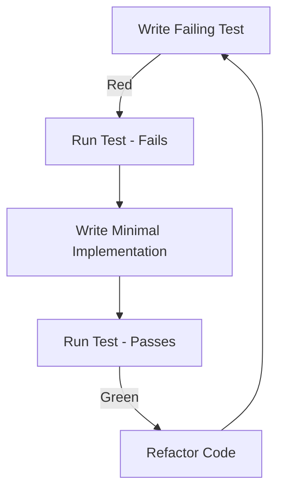
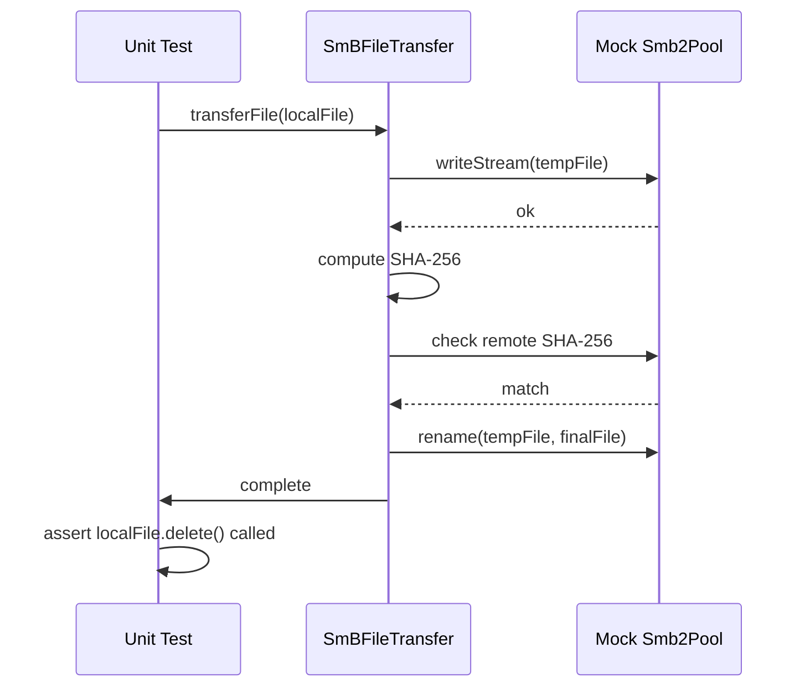

# TrueTransfer TDD Implementation Plan

Build the TrueTransfer Flutter application using a strict Test-Driven Development (TDD) approach based on the requirements defined in `plan.md`.

## User Review Required

> [!IMPORTANT]
> Please review this TDD plan. It emphasizes writing tests for models, services, and controllers *before* their implementations.
> 1. Does the testing sequence (Models -> Services -> Controllers -> UI) make sense to you?
> 2. Are there any specific testing libraries you prefer for mocking dependencies in Flutter (e.g., `mocktail`, `mockito`)?

## Open Questions

> [!TIP]
> Since we are dealing with file systems and network calls (SMB), we will heavily rely on mocking these interfaces for our unit tests. I plan to use `mocktail` for this purpose, but let me know if you prefer another library.

## Proposed Changes

We will approach the project in phases, following the Red-Green-Refactor cycle for each component.

### TDD Workflow

### Phase 1: Models & Persistence (TDD)

We start with the core data structures and their serialization.

**1. Tests to Write (`test/models/` & `test/utils/`):**
- **TransferItem**: Test JSON serialization, default values, and status transitions (e.g., pending -> transferring -> completed).
- **TransferQueue**: Test adding/removing items, calculating total aggregate bytes, and overall queue status.
- **StorageManager**: Test saving queue state to JSON and loading it back using a mock file system.

**2. Implementation (`lib/models/` & `lib/utils/`):**
- Create `TransferItem.dart`, `TransferQueue.dart`, and `StorageManager.dart` to make the tests pass.

### Phase 2: SMB Service Layer (TDD)

This is the most critical logic, ensuring file integrity and safe deletion.

**1. Tests to Write (`test/services/`):**
- **SmBFileTransfer**:
  - *Success Path*: Test stream data to remote, compute SHA-256, verify remote hash matches, perform atomic rename, and finally assert local source file is deleted.
  - *Failure Path (Hash Mismatch)*: Test that if hashes don't match, the remote temp file is cleaned up, the local file is NOT deleted, and an error is thrown.
  - *Failure Path (Network/Timeout)*: Test auto-pause and reconnect logic upon `Smb2Exception`.
- **SmBPoolManager**: Test singleton initialization and worker pool configuration.

**2. Implementation (`lib/services/`):**
- Build `smb_file_transfer.dart` and `smb_pool_manager.dart` using `dart_smb2` and `crypto`, satisfying all test cases.

### Phase 3: State Management (TDD)

Coordinate the models and services.

**1. Tests to Write (`test/controllers/`):**
- **TransferController**:
  - Test that adding files to the queue triggers the `StorageManager` to persist state.
  - Test starting a transfer invokes `SmBFileTransfer` and correctly updates the `TransferItem` status and progress bytes.
  - Test pause/cancel actions.
  - Test app startup logic (loading incomplete transfers from storage).

**2. Implementation (`lib/controllers/`):**
- Build `transfer_controller.dart` extending `ChangeNotifier` to orchestrate the business logic.

### Phase 4: UI & Widget Testing

Build the user interface, driven by widget tests.

**1. Tests to Write (`test/ui/`):**
- **QueueScreen**: Verify file picker triggers and queue items render correctly given a mocked controller state.
- **ConnectionScreen**: Verify SMB credential form validation logic.
- **TransferScreen**: Verify progress bars update based on controller state changes.

**2. Implementation (`lib/ui/`):**
- Build the Material 3 screens: `QueueScreen`, `ConnectionScreen`, `TransferScreen`, and `SummaryScreen`.

## Verification Plan

### Automated Tests
- Continually run `flutter test` throughout the development lifecycle.
- Aim for >90% test coverage on models, services, and controllers before proceeding to UI implementation.

### Manual Verification
- After the UI is wired up to the controller, perform end-to-end testing on both Android and Windows to verify real-world behavior, file permissions, and actual SMB network performance, which mocks cannot fully simulate.
